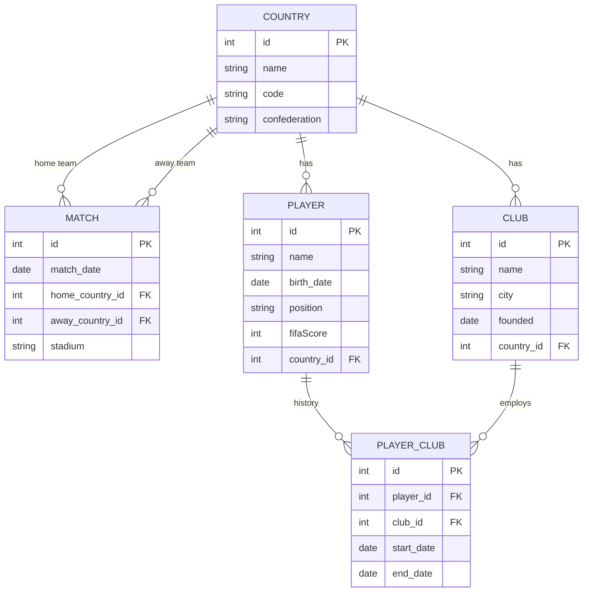

El modelo es

```mermaid
erDiagram

    MATCH {
        int id PK
        date match_date
        int home_country_id FK
        int away_country_id FK
        string stadium
    }

    COUNTRY {
        int id PK
        string name
        string code
        string confederation
    }

    PLAYER {
        int id PK
        string name
        date birth_date
        string position
        int fifaScore
        int country_id FK
    }

    CLUB {
        int id PK
        string name
        string city
        date founded
        int country_id FK
    }

    PLAYER_CLUB {
        int id PK
        int player_id FK
        int club_id FK
        date start_date
        date end_date
    }

    %% Relationships

    COUNTRY ||--o{ MATCH : "home team"
    COUNTRY ||--o{ MATCH : "away team"

    COUNTRY ||--o{ PLAYER : has
    COUNTRY ||--o{ CLUB : has

    PLAYER ||--o{ PLAYER_CLUB : history
    CLUB ||--o{ PLAYER_CLUB : employs
```
